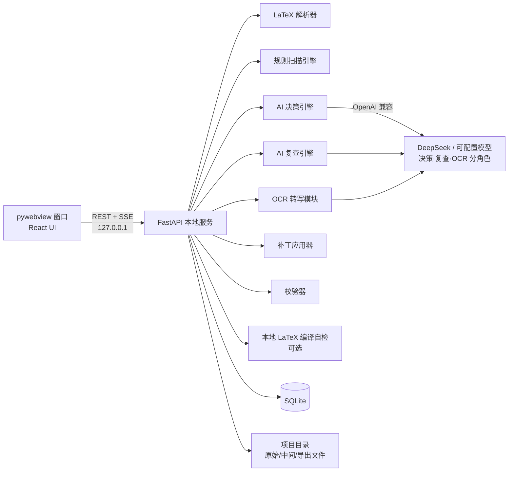
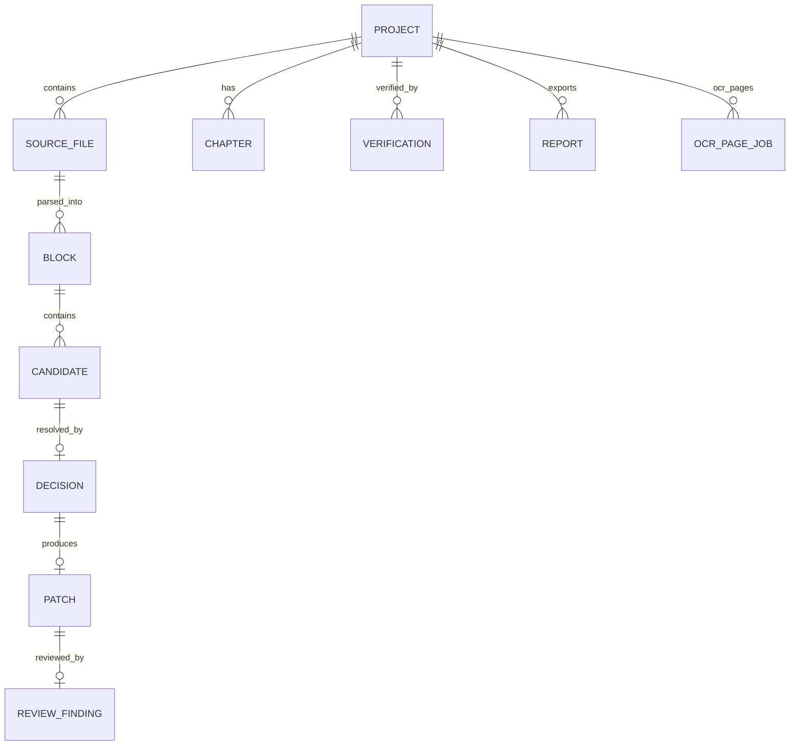

# LaTeX 数学书结构化整理客户端（LaTeXStruct）——完整设计文档

- 版本：0.3（设计定稿·全部产品决策已确认）
- 日期：2025
- 状态：定稿，进入 M1 实现
- 交付形态：**本地桌面客户端**（单人使用，后续可打包分享；核心 UI 为内嵌 Web 界面）
- 整理引擎：**AI 大模型**（可配置；默认 DeepSeek API，OpenAI 兼容，决策/复查/OCR 三角色可分别选模型）
- 默认书籍模板：**ElegantBook**

---

## 目录

1. [项目背景与问题定义](#1-项目背景与问题定义)
2. [需求综合（多份提示词的合并结果）](#2-需求综合)
3. [总体目标与非目标](#3-总体目标与非目标)
4. [已确认的产品决策（v0.2 更新）](#4-已确认的产品决策)
5. [使用场景与用户故事](#5-使用场景与用户故事)
6. [总体架构与客户端形态](#6-总体架构与客户端形态)
7. [核心处理流水线（自动处理 + AI 复查）](#7-核心处理流水线)
8. [LaTeX 解析器设计](#8-latex-解析器设计)
9. [规则扫描引擎（确定性候选识别）](#9-规则扫描引擎)
10. [AI 决策引擎设计](#10-ai-决策引擎设计)
11. [AI 复查引擎设计](#11-ai-复查引擎设计)
12. [OCR 转写模块设计](#12-ocr-转写模块设计)
13. [ElegantBook 模板适配设计](#13-elegantbook-模板适配设计)
14. [补丁模型与"内容不变"校验机制](#14-补丁模型与内容不变校验机制)
15. [数据模型与存储](#15-数据模型与存储)
16. [客户端界面设计](#16-客户端界面设计)
17. [后端 API 设计](#17-后端-api-设计)
18. [配置项设计](#18-配置项设计)
19. [测试与验收标准](#19-测试与验收标准)
20. [开发路线图](#20-开发路线图)
21. [风险与对策](#21-风险与对策)
22. [开放问题（待用户确认）](#22-开放问题)
23. [附录 A：综合后的 AI 系统提示词（母提示词）](#附录-a)

---

## 1. 项目背景与问题定义

### 1.1 背景

用户长期使用多份提示词，让大模型对数学书/论文的 LaTeX 源文件做"结构化整理"：

| 编号 | 提示词 | 核心任务 |
|---|---|---|
| P1 | 整本书批量结构化整理 | 将正文中裸写的定理/定义/证明等转为标准环境；修正已有环境范围错误；习题节转习题环境；双语节标题合并并加入目录 |
| P2 | 论文英中对照稿件编辑 | 保守整理：人名/机构缩写保留原文、中英对照结构保留、tcolorbox 等环境保留、引用性文字不得误转环境 |
| P3 | LaTeX 排版助教 | 按块输出、符号约定统一、交换图 tikzcd、OCR 常见错误修正、最少宏包变动、可编译 |
| P4 | OCR→LaTeX 转写专家 | 全文忠实转写、统一导言区、定理环境模板、算法环境、不确定符号占位、分段续接 |

这四份提示词共同描述了一个**同一类问题**：给一份（可能不规范的）LaTeX 源文件（或书的扫描件）做**结构化规范**，并严格保证**内容不变**。目前用户的做法是"复制提示词 + 粘贴全文 + 人工核对"，痛点：

1. 大模型**重写全文**时容易顺带改动内容（措辞、标点、公式），违反"只改结构"的硬约束，且无法证明"内容确实没变"；
2. 长文档（整本书）超出上下文窗口，需人工分块拼接，前后风格不一致；
3. 处理结果**无法审阅与回退**，不知道改了哪里、为什么改；
4. 提示词零散、规则重复、无版本管理；
5. 全流程依赖在线对话，**不能本地运行**、不能沉淀为工具。

### 1.2 本软件解决的问题

一个**本地桌面客户端**，用户导入整本书/整篇论文的 `.tex`（或扫描件 PDF/图片，经 OCR 转写），系统：

1. 自动识别主 tex 文件、导言区/正文区、章节边界；
2. 确定性规则扫描全部候选结构点（裸写定理标题、证明起始语、习题节、双语标题、范围可疑的已有环境）；
3. 调用 **AI 大模型**（默认 DeepSeek）对候选点做**纯结构决策**——AI 只输出决策 JSON，**绝不重写内容**；
4. 自动应用**最小补丁**并做**机器可验证的"内容不变"校验**；
5. **自动处理完成后，由 AI 复查**（可用与决策不同的模型）对全部变更点做二次审查并自动修正；
6. 提供逐项可审阅的 diff 视图（人类最终抽查），导出整理后的完整 `.tex` 与极简汇报（含歧义项清单）。

---

## 2. 需求综合

将 P1–P4 去重、合并、按优先级排序后的需求规格。每条需求标注来源。

### 2.1 功能需求

| ID | 需求 | 来源 | 优先级 |
|---|---|---|---|
| R1 | 识别裸写定理类标题并包裹为对应环境：Definition/定义→definition，Theorem/定理→theorem，Lemma/引理→lemma，Proposition/命题→proposition，Corollary/推论→corollary，Remark/注(记)→remark，Example/例→example；论文模式追加 Conjecture→conjecture、Problem→problem、Claim→claim | P1, P2 | P0 |
| R2 | 识别证明起始语（`Proof.`、`Proof`、`证明`、`证明：`、`Proof [Outline]`、`Proof [Theorem x.y.z]`、`Sketch of the proof.` 等）并转为 `proof` 环境；附加说明保留为可选参数 `\begin{proof}[Outline]` | P1, P2 | P0 |
| R3 | 已有环境的**范围修正**：环境不能只包标题；不能吞入后续无关段落；proof 必须覆盖同一证明的全部段落与公式；紧接定理陈述的显示公式应纳入定理环境 | P1 | P0 |
| R4 | 习题节识别与结构化：节标题含 EXERCISES/Problems/Exercises/练习/习题/问题集，且正文为连续编号条目时，整节转为习题环境（**ElegantBook 模板下优先用其自带 exercise/problem 环境**；若模板定义 problemset 则用之），裸编号 `1.`、`2.` 转 `\item`；一题内的多段文字、显示公式、中文翻译框整体归入同一 `\item` | P1, v0.2 | P0 |
| R5 | 双语节标题合并：`\section*{英文}` + 仅含中文翻译的 tcolorbox → `\section*{英文（中文）}` + `\addcontentsline{toc}{section}{英文（中文）}`；仅当 tcolorbox 内容纯为标题翻译时才合并并删除该框；无编号但属于正文层级且应入目录的节标题补充 `\addcontentsline` | P1 | P0 |
| R6 | 编号保留：标题自带编号（`Theorem 2.3.4`）时优先保留原编号（`\begin{theorem}[2.3.4]` 或编号留在环境首行）；无编号条目不伪造编号；已有 LaTeX 自动编号结构正确者不得改手工编号 | P1 | P0 |
| R7 | 导言区检查：**文档类为 elegantbook 时沿用其内置环境体系，仅在确实缺失时补充**；其他文档类缺失时补充 `amsthm` 与 `\newtheorem` 定义（含 remark/example 的 `\theoremstyle` 切换）；已有同类定义则沿用，不重复、不强行替换 | P1, v0.2 | P0 |
| R8 | 防误判清单：章节标题、习题条目、文献行、图/表/算法题注、tcolorbox/mdframed 内中文翻译文本、目录/页眉页脚/版权页、附录索引项、"by Lemma 3.1"、"Theorem 1.2 has an application" 等引用性文字，一律不得转为环境 | P1, P2 | P0 |
| R9 | 保守回退与歧义清单：无法可靠判定的条目保持原文，列入最终汇报的"歧义项" | P1, P2 | P0 |
| R10 | 英中对照论文模式：保留所有人名、作者名、机构缩写（CNPq、FAPERJ 等）原文；保留中文译文与对照结构；保留 tcolorbox/mdframed/quote/section 等既有环境；定理被包入环境时中文对照块保留在原位置或紧随其后，不丢失 | P2 | P1 |
| R11 | 输出：整理后的**完整全文 .tex** + 极简汇报（新增包裹 / 范围修正 / 习题环境转换 / 双语标题合并 / 歧义项）；默认只输出结果不夹带解释 | P1, P2 | P0 |
| R12 | 分段输出：一次放不下时按自然边界（节、定理、tcolorbox 结束处）连续输出，用 `%=== CONTINUATION ===` 标记，可无缝拼接 | P4 | P1（客户端内即分块处理 + 进度展示） |
| R13 | 符号与宏约定：单位元 `(1)`、单位化 `\widetilde A`、谱 `\sigma(\cdot)`、理想 `I\triangleleft A`、`\mathbb{S}^n`/`\mathbb{S}_+^n`/`\mathcal{Q}^n`；常用宏 `\R \C \Q \Z \N`、`\norm \abs \inner`、`\DeclareMathOperator`（新书骨架与 OCR 转写模板使用） | P3 | P2 |
| R14 | 交换图用 `tikz-cd`；算法用 `algorithm`+`algpseudocode`；长等式 `aligned/align` | P3, P4 | P2 |
| R15 | 不换包：不替换既有宏包与文档类，仅最小化新增；新增放在文件顶部并最少化 | P3 | P1 |
| R16 | OCR 修正：`1R`→`\mathbb{R}`、`<\cdot,\cdot>`→`\langle\cdot,\cdot\rangle` 等常见误识修正（OCR 转写模式内执行） | P3 | P2 |
| R17 | 不确定符号用 `\textcolor{red}{[?]}` 占位并注释 `% unsure`（OCR 转写模式） | P4 | P2 |
| R18 | **OCR 转写模块**：PDF/图片 → 逐页转写 LaTeX（模型可选），统一导言区（默认 ElegantBook 模板），逐页 `% Page N` 注释，多页并行、断点续传，转写结果直接进入结构化整理流水线 | P4, v0.2 | P0（M2 交付） |
| R19 | **自动处理 + AI 复查**：决策→补丁→机器校验完成后，由 AI 对全部变更点二次复查（可配置与决策不同的模型），发现误包/漏包/范围错误时自动修正，仍不确定的进人工队列 | v0.2 | P0 |
| R20 | **本地运行**：全部处理逻辑与数据在本机；LLM 调用走用户配置的 API；无 Key 时降级为纯规则 + 全部歧义保留 | v0.2 | P0 |

### 2.2 硬性约束（不可妥协）

| ID | 约束 |
|---|---|
| C1 | **只改结构，不改内容**：正文文字、公式、标点、段落顺序逐字不变 |
| C2 | **最小改动**：每次修改只做必要结构编辑；能不动就不动 |
| C3 | **不重复包裹**：已正确的环境绝不二次包裹 |
| C4 | **不误判**：歧义时宁可保守不改 |
| C5 | **可验证**：软件必须能向用户**证明**内容未变（机器校验，而非口头保证） |
| C6 | **可回退**：任何一次决策都可单独接受/拒绝，可整体还原到原始文件 |
| C7 | **全书一致性**：同类条目全书统一处理 |
| C8 | **本地优先**：不依赖任何云端中间服务即可使用核心功能（LLM API 为唯一外部依赖，且可缺省） |

### 2.3 优先级（规则冲突时）

1. 保持原文内容不变
2. 结构正确
3. 不误判
4. 最小改动
5. 全书一致性
6. 局部美观

---

## 3. 总体目标与非目标

### 3.1 目标

- 输入：整本书/整篇论文的 `.tex` 文件（或扫描件 PDF/图片）；输出：**结构化整理后的完整 .tex**；
- 整理动作限定为：包裹/修正 theorem-like 环境、proof 环境、习题列表环境、双语节标题合并、导言区必要补充；
- 全程内容逐字不变，机器可验证；AI 决策透明、逐项可审阅、可回退；
- 流程：**自动处理 → 机器校验 → AI 复查 → 人工抽查（可跳过）→ 导出**；
- 全部本地运行，单人使用，后续可打包成安装包分享。

### 3.2 非目标（V1 明确不做）

- 不做内容改写、润色、翻译、重译、扩写、删减；
- 不做排版重设计（版式、字体、页边距不变）；
- 不做公式的语义纠错（仅结构包裹）；
- 不修改图片、表格、算法、代码、参考文献、索引等非定理类结构（除非与环境包裹直接冲突）；
- 不做多用户/账号体系/云端协作（单人本地工具；"分享"= 分发安装包）；
- 排版助教对话面板（P3 聊天式问答）为远期可选，不进 V1。

---

## 4. 已确认的产品决策（v0.3 定稿）

| # | 问题 | 决策 |
|---|---|---|
| D1 | AI 供应商 | 默认 **DeepSeek API**（OpenAI 兼容，`base_url`/`model`/`key` 可配；决策、复查、OCR 三个角色可分别选模型） |
| D2 | 部署形态 | **本地桌面客户端**：单人使用；后续 **打包分享**（Windows 优先）；同时保留"本地服务 + 浏览器"无壳模式 |
| D3 | 默认书籍模板 | **ElegantBook**：新书骨架、OCR 转写导言区、环境适配均以 elegantbook.cls 为默认基准 |
| D4 | problemset 处理 | 不默认新增 problemset 定义；**习题节需列表语义环境**——实测 elegantbook 的 `exercise` 是定理式单题环境（内放 `\item` 报 Lonely \item），故统一转 `enumerate`（elegantbook 惯用做法）；模板定义 problemset（列表式）则用之；其他文档类同理探测 |
| D5 | 处理流程 | **全自动处理 → AI 复查**（复查模型可配，可与决策模型不同）；人工审阅页保留但默认不强制 |
| D6 | 本地运行 | 核心功能全部本地；外部依赖仅 LLM API（可缺省：降级纯规则模式）；可选本地 LaTeX 编译自检（检测到 TeX Live/MiKTeX 时启用） |
| D7 | OCR | **纳入规划（M2）**；OCR 模型可选（视觉模型，OpenAI 兼容端点可换）；逐页并行 + 断点续传 |
| D8 | 测试基准 | 现阶段无法上传 zip/tex，先构建**自建合成语料**；客户端完成后用户可在本机直接导入真实书稿补充回归集 |
| D9 | 打包平台 | **Windows 优先**；后续视需要再评估 macOS |
| D10 | 复查模型 | **可选择，默认该供应商最强模型**（DeepSeek 默认 `deepseek-reasoner`；省钱可切 `deepseek-chat`） |
| D11 | OCR 模型 | **纯云端视觉模型或带视觉功能的通用模型均可**（OpenAI 兼容端点可配）；本地 OCR 预提取保留为可选降成本开关（默认关） |
| D12 | 客户端命名 | **LaTeXStruct** |
| D13 | 分享打包 | **免安装单 exe**（PyInstaller onefile；保留单目录备选以防杀软误报） |

---

## 5. 使用场景与用户故事

### 场景 A：整本书结构化整理（核心）

> 用户把 `book.tex`（ElegantBook 书稿，定理裸写、习题编号裸写、每节有英文标题 + 中文翻译 tcolorbox）拖入客户端。系统自动识别章节边界，扫描出 120 个候选点，AI 决策生成 96 个补丁，机器校验通过后 AI 复查修正 3 处误包、报出 7 个歧义项。用户抽查两页 diff，直接导出整理后 `.tex` + 汇报。

### 场景 B：扫描书 OCR → 结构化 → 出书稿

> 用户拖入一本数学书的 PDF，选择 OCR 模型（如某视觉大模型），逐页转写为 ElegantBook 模板 LaTeX（含 `% Page N`、`[?]` 占位），合并后自动进入结构化整理流水线，输出可编译书稿骨架 + 待人工补录清单。

### 场景 C：英中对照论文整理

> 用户导入中英对照论文（人名、机构缩写、tcolorbox 翻译框混排），启用"论文保守模式"：人名/缩写保护、引用性文字保护、翻译框保留倾向更高，其余同场景 A。

### 场景 D：无 Key 保守运行 / 断网

> 未配置 API Key 或断网：退化为"纯规则 + 全部歧义项保守保留"，仍可完成高置信条目整理并给出完整歧义清单；已缓存的历史决策可复用，不重复调用。

### 场景 E：分享给朋友

> 用户打包出单机安装包发给朋友；对方填入自己的 DeepSeek Key 即可使用，数据全部留在对方本机。

---

## 6. 总体架构与客户端形态

### 6.1 客户端形态（关键决策）

```
┌─────────────────── 本地桌面客户端（Windows 优先） ───────────────────┐
│  pywebview 原生窗口（内嵌 Edge WebView2 / WebKit）                    │
│  ┌─────────────────────────────────────────────────────────────┐    │
│  │  React Web UI（与浏览器模式共用同一前端）                      │    │
│  └─────────────────────────────────────────────────────────────┘    │
│  加载 http://127.0.0.1:<随机端口>                                    │
│  ┌─────────────────────────────────────────────────────────────┐    │
│  │  FastAPI 本地服务（同进程线程内运行）                           │    │
│  │  LaTeX 解析器 · 规则引擎 · AI 决策 · AI 复查 · 补丁 · 校验     │    │
│  └─────────────────────────────────────────────────────────────┘    │
│  SQLite + 项目目录（%APPDATA%\LaTeXStruct 或自选目录）               │
└──────────────────────────────────────────────────────────────────────┘
        │ 唯一外部依赖（可缺省）
        ▼
   DeepSeek API / 其他 OpenAI 兼容端点（决策、复查、OCR 三角色可分别配置）
```

- **pywebview + FastAPI 同进程**：桌面窗口是"壳"，业务逻辑全在本地 Python 服务；架构与浏览器模式完全一致，日后切回纯 Web 或多机部署零重构；
- **无壳模式**：`--server` 参数启动本地服务，浏览器访问 `127.0.0.1:<port>` 即可使用（不装客户端的兜底）；
- **单实例锁**：防止重复启动两个窗口；
- **数据本地化**：SQLite + 项目文件夹（原始 .tex、中间产物、导出文件、AI 调用日志）；API Key 存本地配置（环境变量/本地配置文件），不出本机；
- **分享路径**：PyInstaller 打包（单目录 → 可选单文件 exe）；未来需要跨平台多端时，同一后端直接以 Web 服务部署。

### 6.2 组件图



### 6.3 技术选型

| 层 | 选型 | 理由 |
|---|---|---|
| 桌面壳 | pywebview（Windows 用 Edge WebView2） | 免打包浏览器内核、体积小、与 Python 后端天然一体 |
| 前端 | React 18 + TypeScript + Vite；Monaco Editor + Monaco Diff Editor；Tailwind | 大文件编辑与 diff 视图现成 |
| 后端 | Python 3.11 + FastAPI + SQLAlchemy + SQLite | LaTeX 文本处理生态在 Python；SSE/后台任务原生支持 |
| 解析器 | **自研轻量解析器**（字符级词法 + `\begin/\end` 环境栈 + 大括号配对 + 章节/段落切分），辅以 `pylatexenc` 宏词法 | 只需结构切分；自研可精确控制行号/偏移，是"最小补丁"的基础 |
| AI 客户端 | OpenAI 兼容 SDK；决策/复查/OCR 三角色独立 `base_url/model/key` | 用户指定"调用 AI"，模型可选 |
| 校验 | 自研：环境栈配平 + 内容哈希 + 允许编辑清单 | 硬约束 C5 落地 |
| 打包 | PyInstaller（Windows 单目录优先） | 分享分发 |
| OCR 图像 | PyMuPDF（PDF 转页图）+ PIL 预处理 | 纯本地，轻量 |

### 6.4 关键设计决策（三条主线）

1. **AI 只做决策，不做重写。** 大模型不输出修改后的 LaTeX，而是输出结构化决策 JSON（动作 + 精确区间 + 环境名）。内容文本永远只来自源文件本身。这是对 P1/P2"只改结构不改内容"从机制上的保证。
2. **确定性规则负责召回，AI 决策负责判断，AI 复查负责纠错，校验器负责兜底。** 规则引擎扫描一切候选（含低置信候选）；AI 判定；复查用（可不同的）模型对全部变更二次审查；校验器在补丁应用后验证内容不变与环境配平，违规自动回退。
3. **补丁化编辑 + 逐项审阅。** 所有修改以（起止行/列, 插入/包裹）形式记录，天然支持最小 diff、单项拒绝、整体还原。

---

## 7. 核心处理流水线（自动处理 + AI 复查）

```mermaid
flowchart TD
  S0[阶段0 摄取] --> S1[阶段1 解析]
  S1 --> S2[阶段2 规则扫描]
  S2 --> S3[阶段3 AI 决策]
  S3 --> S4[阶段4 补丁应用]
  S4 --> S5[阶段5 机器校验]
  S5 -->|失败| S5b[自动回退对应补丁→列入歧义]
  S5 -->|通过| S6[阶段6 AI 复查]
  S6 -->|发现可修正问题| S6b[生成修正决策→重新打补丁→重新校验]
  S6b --> S6
  S6 -->|通过| S7[阶段7 人工抽查(可跳过)]
  S7 --> S8[阶段8 导出 .tex + 汇报]
  S5b --> S6
```

### 阶段 0：摄取

- 导入 `.tex`（或粘贴文本）；检测编码（UTF-8/GBK）、BOM、换行风格（CRLF/LF）并**原样记录**，导出时保持；
- 多文件项目：识别 `\input`/`\include` 引用图定位主文件（V1 支持单文件 + 简单 include 展开）；
- 计算源文件 SHA-256，作为一切内容校验基准。

### 阶段 1：解析 —— 见第 8 节

产出：文档树（导言区、章节节点、块列表），全部偏移为原始字符偏移。

### 阶段 2：规则扫描 —— 见第 9 节

产出：候选清单 `Candidate[]`（类型、置信度、命中规则、所属章节）。

### 阶段 3：AI 决策 —— 见第 10 节

按章节分批，AI 输出结构化决策 JSON；与高置信规则命中合并。

### 阶段 4：补丁应用 —— 见第 14 节

决策 → 最小编辑补丁；应用顺序：导言区补充 → 范围修正 → 双语标题 → 包裹 → proof → 习题环境。

### 阶段 5：机器校验

- 环境配平：`\begin/\end` 栈平衡，括号/花括号平衡；
- **内容不变校验**：按允许编辑清单剔除结构性插入后，与原文逐字符比对（14.3）；
- 失败 → 自动回退相关补丁 → 列入歧义清单。

### 阶段 6：AI 复查（默认开启）—— 见第 11 节

- 输入：全部变更点的结构化 diff（补丁前后各 N 行 + 决策理由 + 决策模型标注）；
- 输出：复查发现 JSON（`ok / wrong-env / wrong-range / should-remove / missed-extra`）；
- 可修正项 → 生成修正决策 → 重新打补丁 → 重新校验（循环上限 2 次，防震荡）；
- 复查模型可配置为与决策模型不同（如决策用 deepseek-chat、复查用更强模型），三角色独立配置；
- 无 Key 或复查关闭 → 跳过，直接进人工抽查。

### 阶段 7：人工抽查（可跳过）

- 逐项 diff 审阅页：接受/拒绝/改环境类型/微调范围；默认全部按"AI 已复查通过"状态呈现；
- 用户可只看歧义项与复查存疑项，一键"全部接受"。

### 阶段 8：导出

- 整理后完整 `.tex`（保持原始编码与换行）+ Markdown 汇报（新增包裹 / 范围修正 / 习题环境转换 / 双语标题合并 / 歧义项清单）+ 决策 JSON。

---

## 8. LaTeX 解析器设计

### 8.1 目标

不追求排版语义，只要求**结构切分**与**精确偏移**：

- 导言区（`\documentclass` 至 `\begin{document}`）与正文区；
- 章节层级：`\chapter \section \subsection \subsubsection`（含 `*` 与可选参数）；
- 环境栈：所有 `\begin{...}/\end{...}`，输出 `(env_name, start_off, end_off, inner_blocks)`；
- 显示数学块 `\[ \]`、`$$ $$`、`equation/align/...` 环境；
- 段落块：按空行切分（记录每段起止行）；
- 注释 `%` 行与 verbatim 类环境（`verbatim`、`lstlisting`、`minted` 内部不切分、不扫描）；
- 保护区域：`\begin{thebibliography}`、`\index` 项、`\maketitle`、页眉页脚宏区标记为"扫描豁免"。

### 8.2 块模型（Block）

```text
Block {
  id, parent_id,
  kind: preamble|chapter|section|subsection|env|para|displaymath|verbatim|comment|protected,
  env_name (当 kind=env),
  start_line, end_line, start_offset, end_offset,
  raw_text,
  children: Block[]
}
```

- 扫描与决策的最小单元是**段落块**；
- 环境内递归保留子块 → "已在某环境内"可机器判断（R8、C3 的机器保障：`\begin{theorem}` 之内的任何文本天然豁免包裹扫描）。

### 8.3 关键判定函数

| 函数 | 作用 |
|---|---|
| `locate_document_boundaries` | 导言区/正文区边界 |
| `build_env_stack` | 环境栈与嵌套关系、未闭合检测 |
| `split_paragraphs` | 段落切分（空行边界） |
| `is_in_protected(offset)` | 是否在注释/verbatim/参考文献/索引/盒子内 |
| `ancestor_envs(block)` | 块的所有祖先环境（豁免判断用） |

---

## 9. 规则扫描引擎（确定性候选识别）

规则引擎 = 高召回扫描器 + 硬排除器。不负责最终判定（AI 负责），但负责：

1. 生成候选，使 AI 不会漏看；
2. 硬排除确定性不可能的情况，减少 AI 调用量；
3. 对模式完全唯一、零歧义的少数情况直接给出高置信决策（可省 AI 调用）。

### 9.1 候选类型

| 类型 | 触发模式（行首/段首，空白符后） | 来源 |
|---|---|---|
| `theorem-like` | `Definition` `Theorem` `Lemma` `Proposition` `Corollary` `Remark` `Example` `Conjecture` `Problem` `Claim`（可带编号 `Theorem 2.3.4`、可带句点/冒号）及中文 `定义` `定理` `引理` `命题` `推论` `注` `注记` `例` | R1 |
| `proof` | `Proof.` `Proof` `证明` `证明：` `Proof [Outline]` `Proof [Theorem x.y.z]` `Sketch of the proof.` `Proof of ...` | R2 |
| `exercise-section` | 节标题匹配 `EXERCISES|Problems|Exercises|练习|习题|问题集`，且其后存在连续编号条目（`1.` `2.` `10.` 等） | R4 |
| `bilingual-title` | `\section*{...}` 后紧跟 tcolorbox，盒内仅一个中文 `\section*{...}` 且无其他内容 | R5 |
| `scope-fix` | 已有环境，正文在环境外（环境结束与正文开始间无空行且正文紧跟）、或环境吞入明显无关后续段落、或 theorem 后紧跟的显示公式在环境外 | R3 |

### 9.2 硬排除（不生成候选、不交 AI）

- 已位于 theorem 类/proof 环境内部的文本（C3 机器保障）；
- 注释、verbatim、`thebibliography`、`\index`、图/表/算法环境内的文本（R8）；
- tcolorbox/mdframed 内作为英文环境中文翻译的辅助标题（R8；AI 最终确认）；
- 段落中间出现的 `theorem 2.2.3 has an interesting application...`、`by Lemma 3.1`（R8）——按"段首行首 + 关键词 + 允许的编号/标点后缀"匹配，天然排除段中引用；
- 章节标题本身（`\section/\chapter` 命令内）。

### 9.3 高置信规则（可跳过 AI，直接决策）

仅当模式**完全确定**且不涉及范围判断：

- 导言区缺失环境定义（且文档类非 elegantbook）→ 补导言区（内容固定，零歧义；elegantbook 下见第 13 节）；
- 裸标题行 + 其后正文直至下一个同类裸标题/章节/环境边界之间**无任何环境嵌套** → 包裹动作本身确定；**范围终点**仍交 AI 确认；`fast_mode` 下按"空行 + 下一个标题"截断。

> 取向：**规则引擎宁可多报候选，由 AI 说"不是"，也不由规则静默漏掉。**

---

## 10. AI 决策引擎设计

### 10.1 核心原则

**AI 的输出只有决策，没有文本。** AI 从不生成数学内容；只在源文件坐标系里画框：

- 内容文本唯一来源 = 源文件；
- 补丁唯一文本 = 固定 LaTeX 结构片段（`\begin{theorem}` 等模板）+ 源文件自身文本的逐字符搬移（双语标题合并）。

### 10.2 决策输出 Schema（JSON，严格校验）

```json
{
  "decisions": [
    {
      "candidate_id": "c-0017",
      "action": "wrap | unwrap | move-boundary | merge-bilingual-title | add-toc | convert-to-exercise-env | set-items | preamble-add | none",
      "env": "theorem | lemma | proposition | corollary | definition | remark | example | conjecture | problem | claim | proof | exercise | problem | problemset | null",
      "title_span":    { "start_line": 12, "end_line": 12 },
      "body_span":     { "start_line": 12, "end_line": 16 },
      "optional_arg":  "2.3.4 | Outline | Theorem 2.2.3 | null",
      "keep_title_text": true,
      "reason": "简短理由（≤40字，审阅界面展示）",
      "confidence": 0.92
    }
  ]
}
```

- 所有 `span` 必须落在候选所在批次上下文范围内，越界即整批作废重试（防幻觉坐标）；
- `action=none` 用于排除（规则多报的候选由 AI 否定）；
- 互斥校验：同一区间不得出现两个包裹决策；嵌套必须合法（习题环境 > `\item` 可嵌套，theorem 内不得再包 lemma）；
- 解析失败（非 JSON / Schema 不合法）→ 指数退避重试 1 次 → 仍失败则该批全部列入歧义，保守不改。

### 10.3 上下文组装（每批输入）

1. **元信息块**（每批重复）：文档类（是否 elegantbook）、已有环境定义体系、节标题风格（编号/无编号）、是否双语、章节号格式、全书已有环境命名（保证 C7 一致性）；
2. **候选及邻域**：每个候选带前后各 N 个段落（默认 N=4，可配），段落带行号与"是否在环境内"标注；
3. **候选清单**：本批全部候选索引（一次调用内做批内一致性判断）；
4. 严格指示：除 JSON 外不得输出任何其他内容。

### 10.4 批大小与长文档策略

- 按"章"分批：每批 ≤ 30 个候选（可配），超出的章拆多批；
- 全书元信息由规则引擎先行提取，每批注入，避免批间风格漂移；
- 批间无共享可变状态 → 可并行、可断点续传（章节粒度）、可单批重试；
- 上下文估算：每候选切片约 40–80 行 → 30 候选 + 元信息 ≈ 2000–3000 行，安全落在 8k–16k token 内。

### 10.5 模式参数

| 模式 | 差异 |
|---|---|
| 书籍模式（默认，ElegantBook） | 启用习题环境转换（模板自带 exercise/problem）、双语标题合并、编号保留全套规则 |
| 论文保守模式 | 追加 Conjecture/Problem/Claim 映射；人名/机构缩写保护；tcolorbox 翻译块保留倾向更高；禁用双语标题合并 |
| 快速模式 | 高置信规则直接决策跳过 AI；仅歧义项走 AI |

### 10.6 成本与安全控制

- 温度 0；`response_format=json_object`；
- 规则硬排除后再进 AI（控制调用量）；
- 决策结果按 `(candidate_id, 源文件 hash, 提示词版本)` 缓存——重跑、微调重跑均复用，不重复计费；
- 单项目预算上限（token/¥）与并发上限可配；超限自动转保守模式；
- 每次调用记录 `role、model、tokens、prompt_version、latency`，供成本统计与提示词回归评估。

### 10.7 提示词管理

- 系统提示词 = 附录 A 母提示词 + 当前模式补充规则 + 输出 Schema + 3–5 个 few-shot 示例（正确/错误决策各半）；
- 提示词版本化存储，项目记录所用版本 → 可回归测试、可升级且旧结果可复现；
- 高级设置里可查看并覆写（专家模式）。

---

## 11. AI 复查引擎设计

### 11.1 目的

"自动处理，然后 AI 复查"：机器校验保证**内容没变**，但"包得对不对"（误包/漏包/范围）仍可能出错。复查由**独立于决策的模型角色**完成，降低"自己检查自己"的确认偏差。

### 11.2 复查输入

对**全部变更点**（而非全文）构造复查包：

- 每个补丁：前后各 M 行上下文（默认 M=6）、补丁动作、环境名、决策理由、决策模型名；
- **漏报采样**：从"未改动"的段落块中按规则抽取高风险样本（如含 `Theorem` 词但规则/决策未处理的段落），交复查模型判断是否漏包；
- 全书风格元信息（同决策阶段）。

### 11.3 复查输出 Schema

```json
{
  "findings": [
    {
      "candidate_id": "c-0017",
      "verdict": "ok | wrong-env | wrong-range | should-remove | missed-extra",
      "fix": { "action": "wrap", "env": "lemma", "body_span": {"start_line":12,"end_line":14} },
      "reason": "……（≤40字）"
    }
  ]
}
```

- `wrong-env / wrong-range / should-remove` 且给出合法 `fix` → 自动生成修正决策 → 重新打补丁 → 重新校验；
- 自动修正循环上限 **2 次**，之后仍存疑 → 转入人工队列（审阅页"复查存疑"标签）；
- `missed-extra`（漏包）按新候选处理：若 fix 合法且置信高则自动补决策，否则列入歧义清单。

### 11.4 配置

| 项 | 默认 |
|---|---|
| 复查开关 | 开启（可关） |
| 复查模型 | 与决策模型同角色配置可不同（如决策 deepseek-chat / 复查 deepseek-reasoner，按成本自选） |
| 采样比例 | 未改动高风险段抽样 5%（可配） |
| 上下文 M | 6 段 |

---

## 12. OCR 转写模块设计（M2 交付）

### 12.1 流程


### 12.2 模型可选（用户明确要求）

- **Provider 抽象层**：任何 OpenAI 兼容视觉端点可配（DeepSeek 视觉模型、qwen-vl、gpt-4o 等，按用户持有的 Key 选择）；`base_url / model / key` 独立于决策/复查角色；
- **本地 OCR 预提取（可选，降成本）**：Tesseract / PaddleOCR 先在本地出文本，LLM 只做"文本→LaTeX 结构化"（不传图），成本远低于视觉模型；识别质量差时自动回退纯视觉模式；
- 设置页提供 OCR 模型下拉 + 自定义端点。

### 12.3 转写规则（P4 综合）

- 逐页转写，页首 `% Page N` 注释，长文档按自然边界分块（`%=== CONTINUATION ===` 标记拼接）；
- 统一导言区：**ElegantBook 模板骨架**（`\documentclass{elegantbook}` + 常用宏，见第 13 节）；
- 定理类内容用对应环境；证明 `\begin{proof}...\end{proof}`（必要时 `\qedhere`）；算法 `algorithm`+`algpseudocode`；交换图 `tikz-cd`；公式行内 `$...$`、展示 `\[...\]/align`；
- 无法辨认的符号 `\textcolor{red}{[?]}` 占位 + `% unsure` 注释；不臆造内容；
- 常见 OCR 误识修正：`1R`→`\mathbb{R}`、`S_4^n`→`\mathbb{S}^n`、`cos v`→`\operatorname{conv} X`、`<\cdot,\cdot>`→`\langle\cdot,\cdot\rangle` 等（R16）；
- 每页输出独立校验：必须为可解析文本、占位符合规、无裸 `\begin` 缺 `\end`；不合规页自动重试 1 次。

### 12.4 工程特性

- 逐页并行（并发可配）、断点续传、单页重跑；
- 成本按页统计（页数 × token × 单价），与决策/复查成本分账显示；
- 转写结果进入主流水线后，同一套"内容不变"校验切换为"转写内容可追溯"校验（页号 → 文本块映射），供人工核对。

---

## 13. ElegantBook 模板适配设计

### 13.1 默认基准

- 新书骨架 / OCR 转写导言区默认：`\documentclass{elegantbook}` + 常用宏（`amsmath, amssymb, amsthm, mathtools`、`\R \C \Q \Z \N`、`\norm \abs \inner`、`\DeclareMathOperator` 等，R13/R14 约定），按需 `tikz-cd`、`algorithm`；
- 用户自有模板优先级更高：只要文档已声明 `\documentclass{elegantbook}` 或检测到 elegantbook 环境体系，一律沿用，不注入重复定义。

### 13.2 环境适配（替代"默认补 amsthm"）

| 情况 | 行为 |
|---|---|
| 文档类为 elegantbook | 沿用其内置定理环境体系（theorem/definition/lemma/proposition/corollary/example/exercise/problem/conjecture/proof 等，**以模板实际定义为准，运行时探测**）；**不补 amsthm 系列**；仅对确实缺失的环境补充同名定义并保持模板风格 |
| 其他文档类 | 按 R7：缺失时补充 amsthm + `\newtheorem` 序列（remark/example 配 `\theoremstyle` 切换）；已有同类定义则沿用 |
| 习题节（R4） | 优先转模板自带 `exercise`（ElegantBook 通常为 `练习`）或 `problem`；模板定义 `problemset` 则用之；均无则用 `enumerate` 包装并在汇报说明 |
| 探测方式 | 扫描源文件导言区 `\newtheorem/\newenvironment` + 本地 elegantbook.cls 内定义（若用户机器已装 TeX） |

### 13.3 双语标题与目录（ElegantBook 场景）

- ElegantBook 常见"英文 `\section*` + 中文翻译 tcolorbox"模式 → 按 R5 合并为 `\section*{英文（中文）}` + `\addcontentsline`；
- ElegantBook 自带的 `\localtableofcontents` 场景：无编号节标题同样补充 `\addcontentsline`，保证局部目录完整；
- 只有标题翻译的 tcolorbox 才允许合并删除；盒内含其他内容一律不动（R5 硬条件）。

---

## 14. 补丁模型与"内容不变"校验机制

### 14.1 补丁（Patch）定义

```text
Patch {
  id, project_id, decision_id, seq,
  op: insert | wrap | move-boundary | merge-bilingual-title | preamble-add | set-items,
  range: (start_line, start_col, end_line, end_col),   # 源文件坐标系
  insert_before: string | null,   # 仅含固定结构模板文本
  insert_after:  string | null,
  moved_text:    string | null    # 搬移场景的源文本（必须逐字符来自源文件）
}
```

所有 `insert_*` 文本只能来自两类来源，其余一律非法：

1. 固定模板库（`\begin{theorem}`、`\end{theorem}`、`\item`、`\addcontentsline{toc}{section}{...}`、导言区补充块等）；
2. 源文件自身文本的**逐字符子串**（搬移场景，如双语标题合并）。

### 14.2 决策 → 补丁转换规则（示意）

| 决策 | 补丁 |
|---|---|
| `wrap(theorem, title_span, body_span)` | `body_span` 起止插 `\begin{theorem}`/`\end{theorem}`；`optional_arg` 非空 → `\begin{theorem}[2.3.4]`；`keep_title_text=false` 时标题行文本移入可选参数（编号保留 R6） |
| `wrap(proof, ..., optional_arg=Outline)` | `\begin{proof}[Outline] ... \end{proof}` |
| `move-boundary` | 删除旧 `\end{env}`、在新位置插入（边界平移，不触碰内容） |
| `convert-to-exercise-env` | 节内首题前插 `\begin{exercise}`（或模板实际习题环境），节尾插 `\end{...}`；每个裸编号 `N.` 替换为 `\item`（编号文本按允许编辑清单处理） |
| `merge-bilingual-title` | `\section*{EN（CN）}` + `\addcontentsline`；删除仅含中文标题的 tcolorbox（删除对象仅为结构框与重复 `\section*` 命令，中文标题文本搬入括号） |
| `preamble-add` | 导言区定位点插入固定补充块 |

### 14.3 "内容不变"机器校验（硬约束 C5）

定义**允许编辑清单**（结构化改动白名单）：剔除清单内文本后，剩余文本必须与源文件逐字符一致。

1. 剔除所有结构性插入（`\begin{...}`/`\end{...}`/`\item`/`\addcontentsline{...}`/`\usepackage{amsthm}`/`\newtheorem{...}`/`\theoremstyle{...}` 等模板文本）；
2. 剔除被 `\item` 替换的裸编号 `N.`（记录于 Patch 的 `removed_text`）；
3. 搬移文本等值校验：双语合并中删除位置与括号内插入的中文标题子串，必须与源文本逐字符相等；
4. 按原始换行风格还原后逐字符比对。

**校验未通过 → 该补丁自动回退 → 条目列入歧义清单。** 使"AI 会不会顺手改内容"成为可验证的工程保证，而非信任问题。

### 14.4 环境配平校验

- `\begin/\end` 栈平衡；花括号、方括号平衡（verbatim/注释区除外）；
- 新增环境不得与已有环境交叉嵌套；失败同样回退并列入歧义。

### 14.5 本地 LaTeX 编译自检（可选）

- 检测本机 TeX Live / MiKTeX（`latexmk` 或 `xelatex`，ElegantBook 需 xelatex）；
- 装则对导出稿跑 `-interaction=nonstopmode`，把编译错误/警告（定位到补丁相关行）展示在导出页；仅报告，不改内容；
- 未安装 → 该功能置灰，不影响其余流程。

---

## 15. 数据模型与存储

### 15.1 实体关系



### 15.2 主要表（SQLite）

| 表 | 关键字段 |
|---|---|
| `project` | id, name, mode(book/paper/fast), template(elegantbook/other), config_json, created_at |
| `source_file` | id, project_id, name, sha256, encoding, newline_style, raw_path |
| `block` | id, source_file_id, parent_id, kind, env_name, start/end offset+line, raw_text |
| `candidate` | id, block_id, kind, rule_id, confidence, status(pending/accepted/rejected/ambiguous) |
| `decision` | id, candidate_id, source(rule/ai/review/manual), action, env, spans_json, optional_arg, reason, confidence, role, model, prompt_version, tokens, cost |
| `patch` | id, decision_id, seq, op, range_json, insert_before, insert_after, moved_text, removed_text |
| `review_finding` | id, patch_id, verdict, fix_json, reason, role, model, status(open/auto-fixed/escalated) |
| `verification` | id, project_id, env_balanced, content_identical, violations_json |
| `report` | id, project_id, markdown |
| `ocr_page_job` | id, project_id, page_no, provider, model, status, cost, output_path, retries |
| `ai_call_log` | id, project_id, role(decide/review/ocr), model, prompt_version, tokens, latency_ms, ok |

存储位置：`%APPDATA%\LaTeXStruct\projects\<项目名>\`（原始、中间、导出、日志），SQLite 单文件。API Key 存本地环境变量/配置文件（`~/.latexstruct/config.toml`），不入库、不上传。

---

## 16. 客户端界面设计

### 16.1 页面清单

| 页面 | 功能 |
|---|---|
| ① 项目列表 | 新建项目（导入 .tex / 粘贴文本 / 新建 ElegantBook 骨架 / PDF 转写）；模式选择（书籍/论文保守/快速） |
| ② 扫描概览 | 文档树 + 候选清单（按章节分组）：类型徽标、命中规则、置信度、状态过滤；【自动处理】按钮 |
| ③ 处理进度 | 章节队列进度、决策/复查/OCR 分批状态、SSE 实时日志、成本统计（按角色分账）、断点续传入口 |
| ④ 决策审阅 | Monaco Diff（左原文右整理稿，逐补丁跳转）；侧栏：候选信息 + 决策理由 + 复查结论 + 按钮【接受/拒绝/改环境类型/微调范围】；过滤器（按类型/状态/复查存疑/歧义） |
| ⑤ 汇报 | Markdown 渲染：新增包裹 / 范围修正 / 习题环境转换 / 双语标题合并 / 歧义项清单（含定位链接） |
| ⑥ 导出 | 整理后 `.tex`（保持原始编码与换行）、汇报 `.md`、决策 JSON、可选本地编译自检报告 |
| ⑦ OCR 转写 | PDF/图片导入、OCR 模型选择、逐页进度与单页预览/重跑、转写结果合并 |
| ⑧ 设置 | 三角色模型配置（决策/复查/OCR：base_url/model/key）、模板默认、预算上限、复查开关、提示词版本（高级） |

### 16.2 交互设计要点

- 默认流程：**自动处理 → AI 复查 → 直接可导出**；审阅页仅作抽查与歧义处理，不强制逐条确认；
- 单项拒绝 → 该补丁撤销；整体还原 → 一键回到原始文件；
- 所有操作在本地窗口完成，无命令行；
- 界面语言：中文。

---

## 17. 后端 API 设计

（本地服务，127.0.0.1 随机端口；与浏览器模式共用）

```
POST   /api/projects                         新建项目（multipart 上传 / JSON 文本 / 新建骨架）
GET    /api/projects                         项目列表
GET    /api/projects/{id}                    项目详情（文档树摘要）
POST   /api/projects/{id}/analyze            阶段1–2：解析 + 扫描
GET    /api/projects/{id}/candidates         候选清单（分页、过滤）
POST   /api/projects/{id}/process            阶段3–6：决策 + 补丁 + 校验 + AI 复查（后台任务）
GET    /api/projects/{id}/process/events     SSE：进度/日志/成本
GET    /api/projects/{id}/diff               整理前后全文 diff / 按 patch 的局部 diff
POST   /api/projects/{id}/decisions/{cid}    单项：accept/reject/change-env/move-boundary
POST   /api/projects/{id}/decisions/{cid}/redo  AI 重判单项
POST   /api/projects/{id}/review             手动重跑复查（指定范围/采样比例）
POST   /api/projects/{id}/verify             手动触发全量校验
GET    /api/projects/{id}/report             汇报（markdown）
GET    /api/projects/{id}/export             导出 .tex / .md / decisions.json
POST   /api/projects/{id}/latexcheck         本地编译自检（可选）
POST   /api/ocr/jobs                         OCR：提交 PDF/图片（逐页任务）
GET    /api/ocr/jobs/{id}/events             OCR 进度 SSE
GET    /api/config                           当前配置（脱敏）
PUT    /api/config                           更新配置（模型/Key/预算/复查开关/提示词版本）
GET    /api/templates/elegantbook            生成 ElegantBook 骨架 .tex
```

---

## 18. 配置项设计

| 配置 | 默认 | 说明 |
|---|---|---|
| `template.default` | elegantbook | 新书骨架/OCR 导言区默认模板 |
| `roles.decide.model` | deepseek-chat | 决策模型 |
| `roles.review.model` | 该供应商最强模型（DeepSeek：`deepseek-reasoner`） | 复查模型可选，默认最强，省钱可切回 `deepseek-chat` |
| `roles.ocr.model` | 用户自选 | OCR 可用纯云端视觉模型，也可用带视觉功能的通用模型（无默认，需用户配置 Key） |
| `roles.*.base_url` | `https://api.deepseek.com` | OpenAI 兼容，可分别覆盖 |
| `llm.temperature` | 0 | 固定 |
| `llm.max_batch_candidates` | 30 | 决策批大小 |
| `llm.context_paragraphs` | 4 | 决策邻域 |
| `review.enabled` | true | AI 复查开关 |
| `review.context_paragraphs` | 6 | 复查上下文 |
| `review.sample_ratio` | 0.05 | 漏报采样比例 |
| `review.max_auto_fix_rounds` | 2 | 自动修正循环上限 |
| `llm.budget_limit` | 无上限 | 单项目 token/费用上限，超限转保守 |
| `rules.enable_high_confidence_auto` | true | 高置信规则直接决策 |
| `pipeline.mode` | book | book / paper-conservative / fast |
| `export.keep_newline_style` | true | 保持原始换行/编码 |
| `ocr.local_engine` | none | none / tesseract / paddleocr（预提取降成本） |
| `ocr.concurrency` | 2 | 逐页并行数 |
| `latex.check` | auto | auto / on / off（检测本机 TeX） |

环境变量/本地配置文件：`LLM_*` 三角色 Key；Key 只存本机，不入库、不显前端。

---

## 19. 测试与验收标准

### 19.1 测试语料

- **合成语料（自建，M1 交付物之一）**：按规则逐条构造（裸定理/编号定理/证明多段/习题节/双语标题/环境范围错误/引用性文字陷阱/盒内中文翻译陷阱/verbatim 陷阱/ElegantBook 环境内陷阱）——每条规则 ≥ 2 正例 + 2 反例；
- **真实书稿**：用户当前无法在对话中上传 zip/tex → 客户端完成后用户**在本机直接导入**真实书稿补充回归集（D8）。

### 19.2 验收标准（硬性，机器可测）

| 指标 | 门槛 |
|---|---|
| 内容不变校验通过率（所有导出文件） | **100%**（失败即回退，绝不导出） |
| `\begin/\end` 配平违规 | 0 |
| 已正确环境被二次包裹 | 0（C3） |
| 章节标题/引用性文字被误包（合成集） | 0（R8 硬排除 + AI + 复查三重防线） |
| 裸定理标题包裹召回率（合成集） | ≥ 95%（其余必须出现在歧义清单而非静默丢失） |
| 歧义项漏报 | 0（凡未改动的候选必须出现在汇报歧义清单） |
| AI 复查有效性 | 注入故障用例（故意误包/漏包），复查检出率 ≥ 90% |
| 大文件（≥ 2000 行、多章）端到端 | 无卡死、进度可观测、断点可续 |
| 无 Key 降级 | 纯规则可跑通、歧义清单完整 |
| OCR 流水线 | 逐页可校验、断点续传、成本分账正确 |

### 19.3 提示词回归

- 母提示词版本与评测集绑定；任何提示词改动先跑离线评测（召回/误包率/成本），通过才发布新版本。

---

## 20. 开发路线图

| 里程碑 | 内容 | 产出 |
|---|---|---|
| M0 | 本设计文档定稿（v0.2 评审确认） | 设计定稿 |
| M1（MVP） | 本地客户端（pywebview + FastAPI）：导入 .tex → 解析 → 扫描 → AI 决策 → 补丁 → 机器校验 → **AI 复查** → diff 审阅 → 导出；书籍模式全规则；ElegantBook 模板适配；无 Key 保守降级；合成测试集 | ✅ 已完成（`latexstruct/`，45 测试全绿） |
| M2 | **OCR 转写模块**（模型可选、逐页并行、断点续传、ElegantBook 骨架）；论文保守模式；本地 LaTeX 编译自检；成本统计面板 | v1.0 |
| M3 | PyInstaller **免安装单 exe** 打包分享（Windows 优先，保留单目录备选防杀软误报）；多文件 include 图；专家提示词覆写；真实书稿回归集导入 | v1.1（可分享版） |
| M4（可选） | 跨平台壳（macOS）；排版助教对话面板（P3 聊天式问答，复用母提示词变体）；多机 Web 部署形态 | v1.2 |

### M1 完成记录（2025）

- 核心流水线全部实现并测试通过：解析（等长屏蔽/精确偏移）、扫描（候选+硬排除）、补丁（可逆编辑日志+内容不变校验）、AI 决策（JSON 决策+坐标白名单）、AI 复查（自动修正上限 2 轮）、汇报；
- **实现偏差（记录在案）**：前端界面 MVP 采用**无构建步骤的原生 JS**（功能与 §16 设计等价：项目/处理/diff 审阅/汇报/设置），React+Monaco 升级推迟到 M2；桌面窗口（pywebview）启动器已实现并安装依赖，本开发环境无显示器仅验证了 `--server` 浏览器模式与 API；真实 LLM 调用需用户配置 Key（决策/复查逻辑经 Fake 客户端全链路验证，无 Key 降级路径已验证）。

### 评审重构记录（2025，按用户代码评审 P0/P1/P2 路线）

**第 7 轮（OCR 两阶段解耦，v0.5.6）：**
1. Stage A 提示词重写：视觉模型只"看清楚"——忠实转写标题行（"Theorem 2.7. ..." 原样保留）、
   公式、图占位；**明确禁止**做任何结构判断（不再要求输出 theorem/proof 等环境）；
2. Stage B 交给既有结构化流水线（`ocr_pipeline()`：转写 → run_pipeline 扫描/决策/补丁/校验），
   与"AI 只决策、Patch 负责改"核心理念统一；视觉识别/公式/版面/结构判断解耦，错误不再耦合；
3. 106/106 测试全绿（新增两阶段语义与提示词断言测试）。

**第 6 轮（Benchmark 金标评测，v0.5.5）：**
1. 新增 `latexstruct/benchmark.py` + `benchmark/golden/*.json`：金标集
   （basic-book / cn-fragment / godsil-1.7 真实切片 / negatives 陷阱集），
   标签用"文本 needle"定位（不依赖脆弱行号）；
2. 指标：按类型（theorem-like 各环境 / proof / exercise-section）计算 P/R/F1，
   内容指标（内容不变/多层不变量/环境配平/可选编译）；Markdown 报告 + CI 门禁
   （`tools/benchmark.py` 任一金标未通过即失败）；
3. **当前成绩**：三个带标签集全 100%（TP 18，FP 0，FN 0），negatives 零误报，
   内容校验全 OK（报告生成于 `benchmark/report.md`）；
4. 如实记录：段首引用句（"Theorem 2.2.3 has an interesting application..."）属
   规则模式**有意的高召回**候选（AI 模式负责排除），金标 negatives 只收录无歧义陷阱。

**第 5 轮（Rule Pack 配置化，v0.5.4）：**
1. 新增 `core/ruleset.py` + `latexstruct/rulesets/*.json`：可配置规则集——
   内置 bilingual（默认=原硬编码规则）/ english / chinese / academic-paper
   （+Conjecture/Problem/Claim/Fact/Observation，且关闭双语标题合并）；
2. 配置维度：title_patterns（关键词→环境映射，自动按语言加防误匹配护栏，
   中文编号捕获保留）、proof_starts、continue_words、end_markers、
   exercise_keywords、bilingual_titles 开关；**用户自定义** = JSON 文件路径
   （未提供字段回退默认），如 {"remark": ["Observation"]} 即可扩展"Observation→remark"；
3. 全链路贯通：`scan/pipeline(pack=...)`；default 包与旧硬编码行为逐项一致
   （99/99 测试，真实书稿候选统计零差异）；
4. 说明：采用 JSON（语义等价于建议的 YAML），保持核心纯标准库；将来可加 YAML 支持。

**第 4 轮（多文件 LaTeX 项目支持，v0.5.3）：**
1. 新增 `core/project.py`：main.tex 自动发现（优先根目录 main.tex → 含 `\documentclass` 者 →
   首个 .tex）、`\input/\include` 依赖图（主文件目录相对解析，符合 LaTeX 语义）、
   缺失引用与循环检测、编码自适应（utf-8-sig/utf-8/gbk）；
2. **带标记展开 → 单文件流水线 → 拆分回文件**：`% === LATEXSTRUCT-FILE-START/END ===`
   标记内联子文件（`\input` 行保留），全部既有能力（解析/扫描/AI 决策/补丁/
   多层校验）在展开文本上生效，结果按标记拆分回各文件，导出到副本目录（资产原样复制）；
3. CLI：`tools/process_project.py <项目文件夹> [输出]`；5 个测试覆盖
   嵌套展开/缺失/循环/端到端/导出；91/91 测试全绿。

**第 3 轮（平衡括号解析，v0.5.2）：**
1. 新增 `core/texparse.py`：目标式平衡括号解析——命令定位用便宜正则 +
   **数学感知的括号平衡扫描器**（`$..$`/`$$..$$`/`\(..\)`/`\[..\]` 区域整体跳过）；
2. 替换 `SECTION_RE` 单层花括号正则：节标题支持嵌套花括号与数学内花括号
   （`\section{A \textit{b} for $K_{r,s}$}` 完整保留），可选参数支持嵌套（`[Short \emph{toc}]`）；
3. 双语翻译框识别同步升级（`interior_section_command`），支持嵌套中文标题；
4. 解析器"已知限制"更新；真实书稿回归零差异（两本书 526/468 节、263/229 双语、
   353/250 证明全部与旧解析一致）；86/86 测试全绿（新增 texparse 7 测试）。

**第 2 轮（多层校验护城河，v0.5.1）：**
1. **多层内容不变量**（`core/invariants.py`，P2 Level 3/4）：数学公式 token 多重集
   （行内/显示/数学环境）、`\label`/`\ref` 系列/`\cite` 系列/`\includegraphics` 路径集合——
   整理前后必须完全一致，任何不一致判定为内容改动并整体回退（纳入 ok 判定）；
2. **编译校验**（`core/compilecheck.py`，P2 Level 5）：本机存在 xelatex 时可选
   整理前后各编译一次，汇报页数/错误摘要（`run_pipeline(compile_check=True)`）；
3. 汇报"机器校验"节展示五类不变量与编译对比；79/79 测试全绿（新增 test_invariants 6 测试，
   含真实 xelatex 编译成功/失败两例）。

**第 1 轮（P0 发布链路与工程债，v0.5.0）：**
1. **发布链路真实闭环**：CI 新增"安装器冒烟测试"（静默安装 → 运行健康检查 → 静默卸载），
   立即抓到两个真实缺陷并修复——版本资源文件被 GBK 误读损坏（CI 改为显式 UTF-8 读写）、
   单文件 exe 孤儿子进程锁文件导致卸载残留（结束全部相关进程 + 轮询等待卸载完成）；
2. **版本号单一事实来源**：`latexstruct/_version.py` 唯一来源，pyproject 动态读取，
   CI 校验 Git tag ↔ 版本，安装器/版本资源由 tag 生成，新增 test_version 套件；
3. **仓库门面**：清理误提交的 CI 调试产物（jobs.json 等）并入 .gitignore；
   补齐 LICENSE（MIT）/ CHANGELOG / CONTRIBUTING，设计文档入仓；
4. 73/73 测试全绿，v0.5.0 发布（含安装器冒烟通过的产物）。

### 五轮持续优化记录（2025）

**第 1 轮（四项指定优化，v0.3.0）：**1. **OCR 转写模块（M2）**：`latexstruct/ocr.py`——PDF（PyMuPDF 渲染）/图片 → 视觉模型逐页转写
   （模型可选，OpenAI 兼容视觉端点，`LLMClient.chat_vision`）→ 逐页重试 → 合并为 ElegantBook 书稿
   （`% Page N` + 分段标记 + 统一导言区）→ 可直接送入结构化流水线；
   服务端后台任务接口 + OCR 页签（页码范围/DPI/进度轮询/结果预览/一键导入项目）；
2. **真实 AI Key 全流程实测**：用本机已配置的真实 DeepSeek Key 跑通
   deepseek-chat 决策 + deepseek-reasoner 复查——合成样例与真实书稿摘录全部 ok、
   内容不变校验通过；复查在真实摘录上真实纠错 9 处（wrong-range/wrong-env/should-remove），
   6 个盒内中文标题被保守判为歧义（符合设计）；新增 Key 互回退（决策/复查/OCR 共用一把 Key 的场景）；
3. **代码签名**：CI 条件签名步骤（GitHub Secrets `WINDOWS_CERT_BASE64`+`WINDOWS_CERT_PASSWORD`，
   signtool SHA256+时间戳，exe 与安装器都签）；PyInstaller 版本资源（version_info.txt，CI 按 tag 动态生成）；
   `scripts/sign_local.ps1` 自签证书（仅本机信任）；README 说明消除 SmartScreen 需 EV/OV 证书；
4. **中文安装器界面**：`installer.iss` 使用官方 ChineseSimplified.isl 并设为默认语言。

**第 2 轮（三项实测 + 修复，v0.3.1）：**
1. **本地安装器全流程 E2E**：winget 安装 Inno Setup 6.7.3 → 本地构建中文安装器 →
   静默安装（目录/开始菜单快捷方式/卸载器）→ 运行安装版（health v0.3.0）→ 静默卸载（目录完全移除）；
   发现并修复 PyInstaller 增量缓存导致打包旧版本的问题（build.ps1 加 `--clean`）；
2. **OCR 真实视觉实测**：xelatex 生成单页数学 PDF → 真实调用 deepseek-chat →
   实测确认其不支持图片输入（HTTP 400）→ OCR 模块增加友好错误提示
   （"请换用支持视觉的模型如 qwen-vl/glm-4v/gpt-4o"）+ 界面文案 + 回归测试；
   修复 OCR Key 回退链（OCR→决策→复查）与 `fitz` 弃用告警；
3. **真实书稿 AI 实测（1.7 节 180 行）**：ok=True、决策 7 处、复查发现 14 项并修正 10 处
   wrong-range（AI 常把图注/翻译框行错包进定理范围，reasoner 全部纠正）；
   **发现高价值优化点**：AI 决策后对 body_span 做"段落边界合法化收缩"（第 3 轮实施）；
   1.7 节切片纳入永久回归样例（65/65 测试全绿）。

**第 3 轮（span 合法化 + 复查成本优化，v0.3.2）：**
1. **AI 决策 span 段落边界合法化**（`core/legalize.py`，实测驱动）：真实书稿实测发现 AI 决策的
   body_span 高频把图注/翻译框/叙述段错包进定理范围（复查 10/14 项 wrong-range）；
   合法化在补丁前对 source=="ai" 的 wrap 做确定性收缩——起点固定为标题段起点、
   终点收缩到下一停点（定理类标题/节标题/证明起始）之前、段落原子性吸附、
   定理类默认收缩到标题段（多段定理陈述由复查显式扩展，复查结果不受影响）；
   修复了 document 环境块误作吸附目标导致 proof 吞全篇的 bug；
2. **复查成本优化**：规则模式的确定性编辑（双语合并/习题转换/导言区）不再送复查；
   **对比实测**：同一 180 行真实切片，wrong-range 修正 10→1，复查 tokens 57.7k→36.8k（-36%），
   剩余 4 项修正为 should-remove（模型保守排除盒内翻译/(b)条目/叙述句）——行为正确；
3. 69/69 测试全绿（新增 legalize 4 测试）。

**第 4 轮（提示词强化 + 漏报抽查 + 质量门禁，v0.3.3）：**
1. **决策提示词强化（PROMPT_VERSION 3.1）**：补充实测中的高频误判否定示例——
   tcolorbox 内中文标题为翻译绝不包裹、"(a)/(b)" 字母编号条目不是定理、图注行不是定理、
   body_span 起点必须为标题行且不含翻译框/图注/后续条目；
2. **漏报抽查复查**：AI 判定"无需处理"的候选进入复查清单，复查可 missed-extra 反悔补包
   （修复了"无 AI 补丁即跳过复查"导致漏报抽查失效的 bug，新增测试）；
3. **质量门禁**：CI 新增 ruff 静态检查（F 规则：未定义名/未用导入），清理 14 处问题；
   pyproject 配置 ruff；
4. 实测记录：LLM 运行方差主导复查修正数（3 次实测修正 4–10 项，均为合理纠错），
   内容不变/环境配平每次通过；70/70 测试全绿。

**第 5 轮（全书级实测收官，v0.4.0）：**
1. **复查分块**（整书规模前提）：复查按 `review_batch`（默认 25）分批调用，避免整本书
   数百补丁单次调用超上下文；歧义清单提示截断（前 50 项）；空补丁但有漏报清单时仍发一次复核；
2. **全书级 AI 实测**（Godsil 3.58 万行，真实 Key 全链路：决策 deepseek-chat +
   复查 deepseek-chat 分块 + span 合法化 + 内容不变校验）：
   15.3 分钟、**827 个补丁**、0 拒绝、481 歧义保留、复查 1382 项发现修正 735 项、
   内容不变/环境配平全部通过、总成本约 $0.55；产出 `-ai-result.tex` 与 `-ai-report.md`；
3. 71/71 测试全绿；README/设计文档完成五轮演进记录；发布 v0.4.0。

**五轮总览**：v0.2.0 → v0.4.0，9 个 Release 全自动发布；
核心能力：规则/AI 双模式结构化整理（内容不变机器保证）→ 整段证明 → ElegantBook 模板转换 →
OCR 转写 → 真实 AI 全链路（span 合法化 + 分块复查 + 漏报抽查）→ 安装版 + 主动更新 +
CI 全自动发布 + 质量门禁。

- **安装版客户端**：PyInstaller 单文件 exe（GUI 模式，18.4MB）+ Inno Setup 安装器
  （每用户安装、开始菜单/桌面快捷方式、卸载器；`/SILENT` 静默升级参数）；
  修复 windowed 模式下 `sys.stdout/stderr=None` 导致 uvicorn 崩溃的问题（devnull 兜底）；
- **主动更新**：`latexstruct/updater.py` 查询 GitHub Releases latest → 版本比较 →
  下载 `*-setup.exe` → 静默安装；界面含版本显示 + 更新横幅 + 一键更新；
  更新源 `UPDATE_REPO` 可配置，无 Release 时优雅降级；
- **GitHub 全自动流水线**：仓库 https://github.com/Ararataki-number-one/LaTeXStruct；
  GitHub Actions：push tag v* → 测试（9 套件）→ 版本一致性校验 → PyInstaller →
  Inno Setup（choco 安装）→ 发布 Release（含 exe + setup.exe）；
  发布新版本 = 改 `__version__` + commit + `git tag vX.Y.Z && git push`，其余全自动；
- 书稿语料（corpus/）与本地构建产物均不入库（.gitignore）。

### M1 完善记录（2025，第二轮）

1. **整段证明（规则模式启发式）**：proof 环境从起始语覆盖到整段证明——
   并入显示公式、align 等环境、中文译文框、以连接词/小写/公式开头的续段；
   在下一个定理类标题/节标题/另一证明/叙述性重启段（如 "There is another..."）之前停止；
   含 □/证毕 的段落为结束符（含该段）。AI 模式提示词同步强化了证明范围规则。
   两本书 603 个证明全部整段包裹（最长 111 行），抽查边界正确。
2. **ElegantBook 模板转换（新增 pipeline 前置阶段 `core/template.py`，客户端可选开关）**：
   `\documentclass{article}` → `{elegantbook}`；删除与 elegantbook 冲突/重复的
   geometry/ctex/tcolorbox[most]/`\circled`；章标题 `\section*{N Title}` →
   `\chapter*{N Title}` + `\refstepcounter{chapter}`（保证定理按章计数）；
   删除原书手工目录（`\section*{Contents}` 至第一个真实章标题）并插入 `\tableofcontents`，
   配合双语合并生成的 `\addcontentsline`（章级用 {chapter}）自动生成 LaTeX 目录；
   模板阶段属用户授权的显式变换，内容不变校验以转换后文本为基准。
3. 双语合并修复：`build_ops` 曾硬编码 `\section*`，章标题转换后校验失败——改为按 `section_cmd`
   动态匹配（`\chapter*{...}` 同样可合并）；翻译框检测窗口扩至 +3 行（容纳 `\refstepcounter`）。
4. xelatex 编译迭代验证：tcolorbox 选项冲突、`\circled` 重复定义、习题环境语义错误
   （elegantbook 的 exercise 为定理式单题环境，`\item` 报 Lonely \item → 习题节统一转 enumerate）
   均由模板阶段/环境探测修复；**诊断编译（仅注释原书既有 matrix 行）654 页全部通过 exit 0**，
   即全部结构化插入与模板转换可编译；原书既有的 `\left(` 内嵌 matrix 问题
   （TeX Live 2026 内核 bug，两本书共 559 处）自动列入汇报"已知问题"节，不修改内容。

### M1 真实书稿打磨记录（2025）

用两份真实双语书稿（Godsil《Algebraic Graph Theory》3.58 万行、Jukna《Extremal Combinatorics》3.15 万行，逐段英中对照 + 5188/5324 个 tcolorbox 翻译框、零既有环境）端到端打磨，发现并修复：

1. **性能**：扫描引擎双语检测每节全表扫盒子且重复重建行索引 → 建立行号/盒子索引缓存（>600s → 0.04s，约 1.5 万倍）；
2. **`\begin{tcolorbox}\relax`**：真实书稿的翻译框带 `\relax`，双语标题检测正则未容错 → 修复后两本书分别合并 263/229 组双语标题并加入目录（源书无 `\tableofcontents`，条目惰性生效）；
3. **编号提取**：裸写标题 `Theorem 1.7.2 ...` → `\begin{theorem}[1.7.2]` + 标题词条从前缀剥离（编号保留进可选参数，P1 编号规则）；Proof/证明起始语同样剥离；全部为可逆编辑、内容不变校验兜底；
4. **习题节误改译文**：习题节中文翻译框内的 `1. 设…` 曾误判为题号被转成 `\item` → 条目收集排除盒内段落，译文逐字保留（P1 规则 11.6）；
5. **验证**：两本书合计 1912 个补丁全部通过内容不变/环境配平校验（50 测试全绿，含真实摘录回归样例）；xelatex 编译自检产出 67 页 PDF，唯一致命错误与原文编译对照确认系原书既有矩阵内容问题，与结构化插入无关；无 `\tableofcontents` 的源书目录条目惰性无害。

---

## 21. 风险与对策

| 风险 | 影响 | 对策 |
|---|---|---|
| AI 幻觉坐标/环境名 | 破坏文件 | 坐标越界即废批；env 名白名单校验；配平+内容不变双校验，失败自动回退 |
| AI 误判（把引用当定理） | 违反 C4 | 规则硬排除 + AI 复查（独立角色）+ 审阅页兜底 |
| AI 复查与决策同病（同模型盲区） | 复查失效 | 复查模型可独立配置（建议更强/不同模型）；复查只看 diff 不看结论的提示词设计 |
| 整本书成本过高 | 不可用 | 规则先筛、决策缓存、批上限、预算熔断转保守模式 |
| 复杂 TeX（宏展开、`\def`、跨文件 include）导致解析错位 | 补丁错位 | 无法确定区域标"豁免"；补丁应用前做锚点文本二次校验（Patch 记录锚文本，应用时确认该位置文本未变） |
| 中文标题合并误删含正文的 tcolorbox | 违反 C1 | 合并硬条件："盒内仅一个中文节标题、无其他内容"；否则不合并并列入歧义 |
| 双语标题搬移时编码/空格不一致 | 校验失败 | 搬移文本一律取源文件逐字符子串；校验器兜底 |
| OCR 视觉模型幻觉/漏字 | 转写失真 | 逐页独立校验、`[?]` 占位、单页重试、页号→文本映射供人工核对；转写属独立模块，不混入"内容不变"保证 |
| pywebview 平台差异 / 单文件 exe 杀软误报 | 分享受阻 | Windows 优先适配（WebView2 随系统）；onefile 为主并保留单目录备选与 `--server` 浏览器兜底模式；后续可代码签名缓解误报 |
| 本机未装 TeX | 编译自检不可用 | 功能置灰优雅降级；结构化整理不依赖 TeX |

---

## 22. 已确认决策汇总（v0.3，全部问题已关闭）

1. 打包平台：**Windows 优先**（D9）。
2. 复查模型：**可选择，默认该供应商最强模型**；DeepSeek 默认 `deepseek-reasoner`，可切 `deepseek-chat`（D10）。
3. OCR 模型：**纯云端视觉模型或带视觉功能的通用模型均可**；本地 OCR 预提取保留为可选开关（默认关）（D11）。
4. 客户端名称：**LaTeXStruct**（D12）。
5. 分享打包：**免安装单 exe**（PyInstaller onefile，保留单目录备选）（D13）。

设计阶段到此定稿，进入 M1 实现（仓库目录：`latexstruct/`）。

---

## 附录 A

### 综合后的 AI 系统提示词（母提示词，v2 草稿）

> 四份提示词 P1/P2 综合去重 + ElegantBook 适配后的引擎系统提示词（规则本体）。每次调用 AI 时追加：当前模式补充规则、输出 JSON Schema、few-shot 示例与"只输出 JSON"指令。提示词版本化存储。

```text
你是「LaTeX 数学文档结构化整理引擎」。你的唯一任务：对给定的候选点做出纯结构决策。
你只输出决策 JSON，绝不生成、改写、翻译任何正文内容。

【根本原则】
1. 只改结构，不改内容：正文文字、数学公式、标点、段落顺序逐字不变。
2. 最小改动：能不动就不动；无法确定时选择不动。
3. 绝不重复包裹已正确的环境。

【候选点类型与决策】
A. 定理类裸标题（行/段首：Definition/Theorem/Lemma/Proposition/Corollary/Remark/Example/
   定义/定理/引理/命题/推论/注/注记/例；论文模式追加 Conjecture/Problem/Claim）：
   - 确为正式条目标题 → action=wrap，env 取对应环境；标题自带编号（如 Theorem 2.3.4）
     时编号保留进 optional_arg 或环境首行，不得丢失；
   - 无编号条目（Remark./Example.）→ 直接包裹，不伪造编号。
B. 证明起始语（Proof./Proof/证明/证明：/Proof [Outline]/Proof [Theorem x.y.z]/
   Sketch of the proof.）：
   - 确为证明开始 → action=wrap, env=proof；附加说明（Outline 等）保留为可选参数；
   - proof 必须覆盖同一证明的全部段落与公式（含多段证明与收束文字）。
C. 已有环境范围错误：
   - 环境只包了标题、正文在外 → move-boundary 扩大；
   - 环境吞入后续无关说明/背景段落 → move-boundary 缩小；
   - theorem 后紧跟的显示公式属于定理陈述 → 纳入定理环境；
   - 环境内正文与结构正确 → action=none（绝不重复包裹）。
D. 习题节（节标题含 EXERCISES/Problems/Exercises/练习/习题/问题集 且正文为连续编号条目）：
   - 转为文档模板自带的习题环境（ElegantBook 通常为 exercise/problem，以模板实际定义为准；
     模板定义 problemset 则用之）；裸编号 N. → \item；一题内多段/公式/翻译框归属同一 \item；
   - 习题条目即使以 Prove that / Show that 开头也一律是习题，不是定理。
E. 双语节标题（\section*{英文} 后紧跟仅含中文翻译标题的 tcolorbox）：
   - merge-bilingual-title：合并为 \section*{英文（中文）} + \addcontentsline，删除该翻译框；
   - 盒内除中文标题外还有任何其他内容 → 不合并。
F. 无编号正文层级节标题（\section*/\subsection*/\subsubsection* 且应入目录）：
   - add-toc：补充 \addcontentsline（仅标题层级，绝不包含习题项/图表标题/盒标题）。

【硬性排除：以下任何情况必须 action=none】
- 候选位于任何 theorem 类/proof 环境内部；
- 位于注释、verbatim、参考文献、索引、图/表/算法题注内；
- tcolorbox/mdframed 中作为英文环境中文翻译的辅助标题；
- 章节标题本身；目录/页眉页脚/版权页；附录索引项；
- 引用性文字（"by Lemma 3.1"、"Theorem 1.2 has an application..."）；
- 证明内部的 "Claim 1"/局部断言（除非上下文明确，否则不动）。

【决策冲突优先级】
保持原文内容不变 > 结构正确 > 不误判 > 最小改动 > 全书一致性 > 局部美观。

【输出】
仅输出一个 JSON 对象，schema 如系统注入所示；所有坐标必须在给定切片范围内；
无法判定的候选输出 action=none 且 reason 注明"歧义"，交由人工歧义清单。
```

---

*（文档完）*
